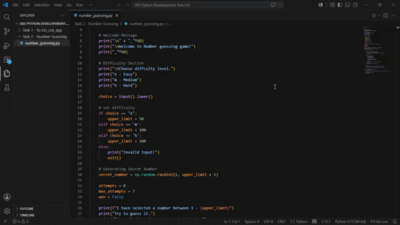
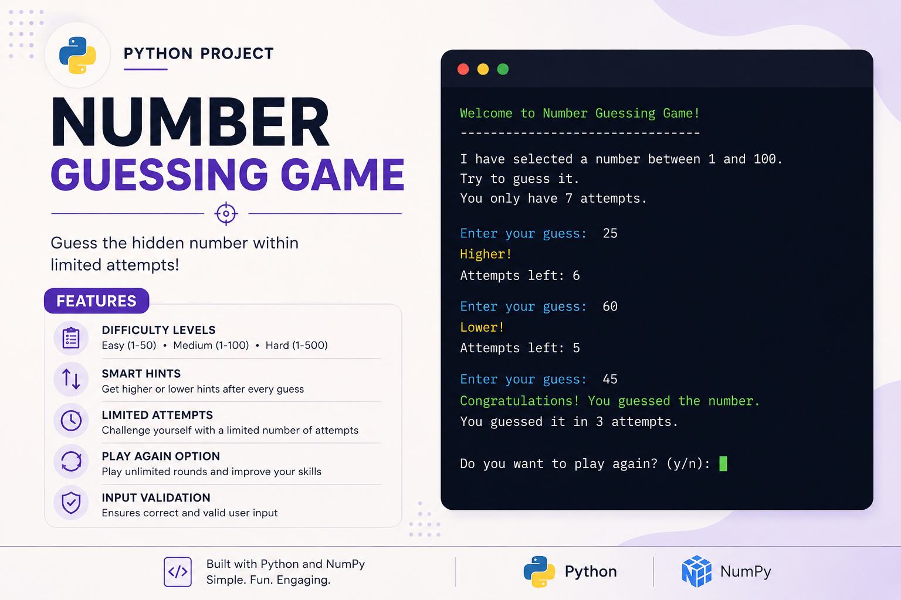
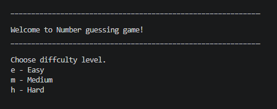
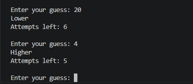
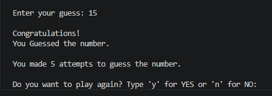
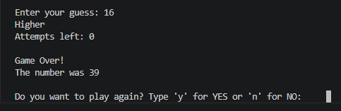
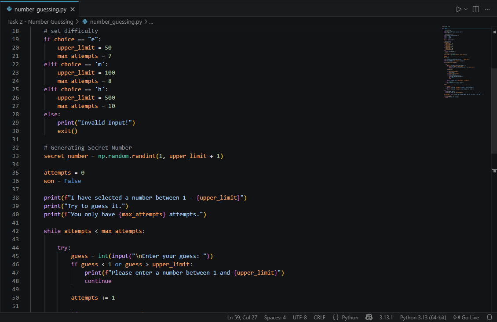

# Number Guessing Game 🎮

An interactive Python Number Guessing Game built for **Saiket Systems**.

Guess the hidden number within limited attempts!

---

## 🎥 Live Demo



---

## ✨ Features

✅ 3 Difficulty Levels (Easy: 1-50 | Medium: 1-100 | Hard: 1-500)
✅ Smart Hint System (Higher/Lower feedback)
✅ Limited Attempts (7 for Easy, 6 for Medium, 5 for Hard)
✅ Play Again (Unlimited rounds)
✅ Input Validation (Error handling)
✅ Interactive CLI Interface

---

## 📸 Project Preview



---

## 🚀 How to Run

```bash
# Clone repository
git clone https://github.com/YOUR_USERNAME/Number-Guessing-Game.git
cd Number-Guessing-Game

# Run the game
python number_guessing_game.py
```

---

## 📖 Gameplay

### Step 1: Choose Difficulty Level



- **Easy:** 1-50 range, 7 attempts
- **Medium:** 1-100 range, 6 attempts
- **Hard:** 1-500 range, 5 attempts

### Step 2: Make Your Guesses



Enter your guess → Get "Higher" or "Lower" hint → Keep guessing!

### Step 3a: Win Screen



Congratulations! You found the number!

### Step 3b: Lose Screen



Game over! Try again on a different difficulty level.

---

## 💻 Code Structure



**Main Components:**
- `main()` - Game loop
- `get_difficulty()` - Difficulty selection
- `play_game()` - Core game logic
- `provide_hint()` - Higher/Lower feedback
- `play_again_prompt()` - Replay option

---

## 💻 Technical Stack

- **Language:** Python 3.x
- **Concepts:** Random generation, Conditionals, Loops, Input validation, State management

---

## 🎓 Learning Outcomes

✅ Game development logic
✅ Algorithm design
✅ State management
✅ User interaction design
✅ Input validation & error handling
✅ Code organization & modularity

---

## 📄 License

MIT License

---

## 🔗 Related Projects

[Task 1: To-Do List Application](https://github.com/khushirai2216-boop/To-Do_List_app)

---

Built for **Saiket Systems Python Development Internship** 🚀